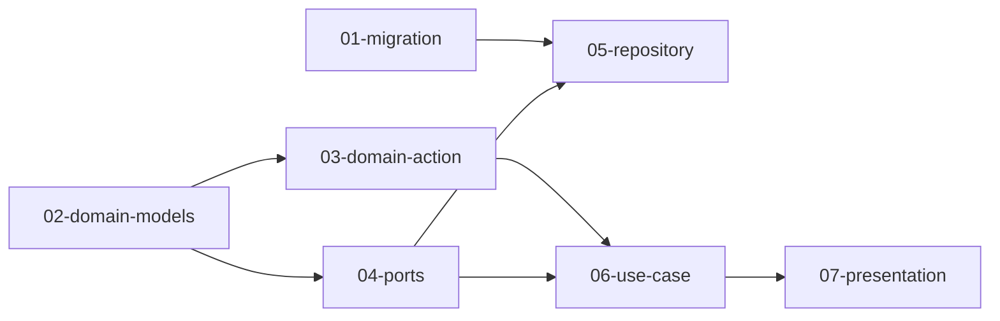

# Feature: create_trial

## 概要

Project に紐づく「試行（Trial）」の作成機能を実装する。Trial は複数の Step から構成され、各 Step には様々な種類の Parameter を記録できる。

## 元の要件

> project に紐づく「試行」の作成機能を作りたいです
> 試行は project と 1:N の関係で、以下の要件があります
>
> - 試行ごとに材料、配分、温度、作業時間などを自由に入力可能
>   - バゲットプロジェクトに対して、粉の量、水の量、水の温度、こね時間などを入力可能
> - 試行は一つ以上のステップから成り立つ
>   - バゲットの試行では捏ね、一次発酵、整形、二次発酵、焼成のステップがあり、それぞれのステップで任意のパラメーターを入力可能
>     - 捏ねは材料、配分、水温度、捏ね時間など
>     - 発酵は気温、時間など
>     - 焼成は温度、時間など
>       - 焼き始め何分で温度を何度に変更、焼き始め何分で天板の上下を入れ替え、なども記録したい
>   - パラメーターは材料（粉 : 300g）のように必ずしも key: value の関係が成立するとは限らない
>     - 発酵を冷蔵庫で行う、などの key: value ではなく純粋なテキストのパラメーターもありうる

---

## 要件分析

### 機能要件

- Project に対して Trial を作成できる
- Trial は 1 つ以上の Step を持つ
- Step には任意の名前を付けられる（任意）
- Step は順序（position）を持つ
- Step には開始時刻を記録できる（任意）
- Step には複数の Parameter を記録できる
- Parameter は以下の 4 種類をサポート:
  - **KeyValue**: key と値（テキストまたは数量）のペア
  - **Text**: 自由テキスト
  - **DurationRange**: 期間（こね時間、発酵時間など）
  - **TimePoint**: 時点（焼成開始 10 分後に温度変更など）
- Trial にはステータス（InProgress / Completed）がある
- Trial の実施日は最初の Step の started_at から導出する

### 非機能要件

- 将来の試行間比較・分析機能を見据え、数値は型レベルで保証する
- Parameter の Quantity は i32 + Unit で表現
- 時間は独自の Duration 型で単位と値を管理

---

## ドメインモデル設計

### エンティティ関係

```
Project (既存)
  └── Trial (1:N)
        ├── id: TrialId
        ├── project_id: ProjectId
        ├── status: TrialStatus
        ├── memo: Option<String>
        └── [Step] (1:N、順序付き)
              ├── id: StepId
              ├── trial_id: TrialId
              ├── name: Option<String>
              ├── position: u32
              ├── started_at: Option<DateTime<Utc>>
              └── [Parameter] (1:N)
                    ├── id: ParameterId
                    ├── step_id: StepId
                    └── content: ParameterContent
```

### ParameterContent

```rust
pub enum ParameterContent {
    KeyValue(KeyValueParameter),
    Text(TextParameter),
    DurationRange(DurationRangeParameter),
    TimePoint(TimePointParameter),
}
```

### 各パラメーター型

```rust
pub struct KeyValueParameter {
    key: String,
    value: ParameterValue,
}

pub enum ParameterValue {
    Text(String),
    Quantity { amount: i32, unit: Unit },
}

pub struct TextParameter {
    value: String,
}

pub struct DurationRangeParameter {
    duration: Duration,
    note: Option<String>,
}

pub struct TimePointParameter {
    elapsed: Duration,
    note: String,
}
```

### 単位

```rust
pub enum Unit {
    Gram,
    Kilogram,
    Celsius,
    Milliliter,
    Liter,
    Percent,
}

pub enum TimeUnit {
    Second,
    Minute,
    Hour,
}

pub struct Duration {
    value: std::time::Duration,
    display_unit: TimeUnit,
}
```

### TrialStatus

```rust
pub enum TrialStatus {
    InProgress,
    Completed,
}
```

---

## 影響範囲

| レイヤー | 影響 | 変更概要 |
|----------|------|----------|
| domain | あり | Trial, Step, Parameter モデル、Duration, Unit, TimeUnit 型、create_trial アクション |
| ports | あり | TrialRepository トレイト、UnitOfWork への追加 |
| use_case | あり | create_trial ユースケース |
| repository | あり | PgTrialRepository 実装、Row 構造体 |
| presentation | あり | Trial, Step, Parameter の GraphQL 型、Mutation |
| migration | あり | trials, steps, parameters テーブル |

---

## タスク分解

### 分解方針

レイヤーごとにタスクを分割し、依存関係に従って実装順序を決定する。
Migration を最初に行い、DB スキーマを確定させてから各層を実装する。

### タスク一覧

| # | タスク | ディレクトリ | 依存 |
|---|--------|--------------|------|
| 01 | DB マイグレーション | [01-migration/](./tasks/01-migration/) | - |
| 02 | ドメインモデル定義 | [02-domain-models/](./tasks/02-domain-models/) | - |
| 03 | ドメインアクション | [03-domain-action/](./tasks/03-domain-action/) | 02 |
| 04 | Ports 定義 | [04-ports/](./tasks/04-ports/) | 02 |
| 05 | Repository 実装 | [05-repository/](./tasks/05-repository/) | 01, 04 |
| 06 | Use Case 実装 | [06-use-case/](./tasks/06-use-case/) | 03, 04 |
| 07 | Presentation 実装 | [07-presentation/](./tasks/07-presentation/) | 06 |

### 実装順序



---

## 前提条件

- Project モデルが既に存在すること
- PgUnitOfWork パターンが確立されていること

## オープンクエスチョン

なし
