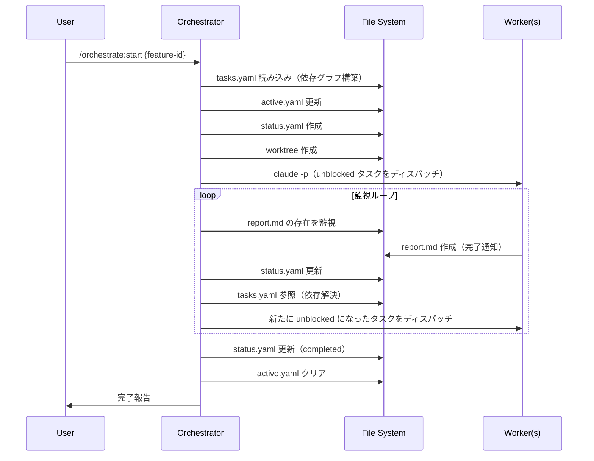
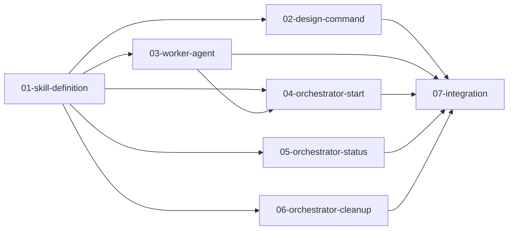

# Feature: parallel_orchestration

## 概要

Claude Code による複数タスクの並列オーケストレーション機構を導入する。
オーケストレーターがワーカーを統制し、ファイルベースで状態を管理することで、Feature 内のタスクを効率的に並列実行する。

## 元の要件

> オーケストレーターによる統制と、`-p` オプション（非対話モード）を活用したワーカーの自律実行を組み合わせた並列実行機構の導入

---

## 要件分析

### 機能要件

1. **オーケストレーター**
   - Feature のタスク定義（`tasks.yaml`）を読み込み、依存グラフを構築
   - 依存が解消されたタスクを並列でワーカーにディスパッチ
   - ワーカーの完了を `report.md` の作成で検知
   - 実行状態を `status.yaml` で管理

2. **ワーカー**
   - 指定されたタスクを自律的に実行
   - 完了時に `report.md` を作成（オーケストレーターへの完了通知）
   - worktree 環境で作業（ワーカー自身は worktree を意識しない）

3. **状態管理**
   - `active.yaml`: 現在進行中の Feature（グローバル）
   - `tasks.yaml`: タスク定義・依存関係（静的）
   - `status.yaml`: 実行状態（動的、オーケストレーターのみ更新）

4. **設計コマンド**
   - 既存の `/design` を拡張し、`tasks.yaml` も同時生成

### 非機能要件

- ファイルベースの状態管理（エージェント間通信なし）
- Docker Compose 環境は全ワーカーで共有
- worktree ごとにブランチを分離

---

## 影響範囲

| 対象 | 影響 | 変更概要 |
|------|------|----------|
| `.agents/` | あり | `active.yaml`, `worktrees/` ディレクトリ追加 |
| `.agents/features/` | あり | `tasks.yaml`, `status.yaml` の追加 |
| `.claude/commands/` | あり | `orchestrate/` コマンド群の追加 |
| `.claude/agents/` | あり | `parallel-worker.md` の追加 |
| `.claude/skills/` | あり | `parallel-orchestration/` スキルの追加 |

---

## アーキテクチャ

### ファイル構成

```
.agents/
├── active.yaml                            # 現在進行中の Feature
├── worktrees/                             # git worktree の実体（.gitignore対象）
│   └── {feature-id}_{task-name}/
│
└── features/{feature-id}/
    ├── spec.md                            # Feature 仕様
    ├── tasks.yaml                         # タスク定義・依存関係（静的）
    ├── status.yaml                        # 実行状態（動的）
    └── tasks/
        └── {task-name}/
            ├── spec.md                    # タスク仕様
            └── report.md                  # ワーカーが作成

.claude/
├── commands/
│   └── orchestrate/
│       ├── design.md                      # 並列実行用の設計
│       ├── start.md                       # オーケストレーター起動
│       ├── status.md                      # 状況確認
│       └── cleanup.md                     # 完了処理
│
├── agents/
│   └── parallel-worker.md                 # ワーカー用 sub agent 定義
│
└── skills/
    └── parallel-orchestration/
        └── SKILL.md                       # 機構の説明とガイドライン
```

### ワークフロー



### 責務分離

| 役割 | 責務 | 編集可能ファイル |
|------|------|-----------------|
| **オーケストレーター** | worktree 準備、ワーカー起動、状態管理 | `active.yaml`, `status.yaml`, worktree 操作 |
| **ワーカー** | タスク実行、レポート作成 | ソースコード、`report.md` のみ |

---

## タスク分解

### 分解方針

機構の各構成要素を独立したタスクとして実装する。スキル定義を最初に行い、それを参照しながら各コマンド・エージェントを実装する。

### タスク一覧

| # | タスク | ディレクトリ | 依存 |
|---|--------|--------------|------|
| 01 | スキル定義 | [01-skill-definition/](./tasks/01-skill-definition/) | - |
| 02 | 設計コマンド | [02-design-command/](./tasks/02-design-command/) | 01 |
| 03 | ワーカーエージェント | [03-worker-agent/](./tasks/03-worker-agent/) | 01 |
| 04 | オーケストレーター起動 | [04-orchestrator-start/](./tasks/04-orchestrator-start/) | 01, 03 |
| 05 | 状況確認コマンド | [05-orchestrator-status/](./tasks/05-orchestrator-status/) | 01 |
| 06 | クリーンアップコマンド | [06-orchestrator-cleanup/](./tasks/06-orchestrator-cleanup/) | 01 |
| 07 | 統合テスト | [07-integration/](./tasks/07-integration/) | 02, 03, 04, 05, 06 |

### 実装順序



---

## 前提条件

- Claude Code のローカル環境が利用可能
- `claude -p` オプション（非対話モード）が利用可能
- git worktree が利用可能

## オープンクエスチョン

なし
