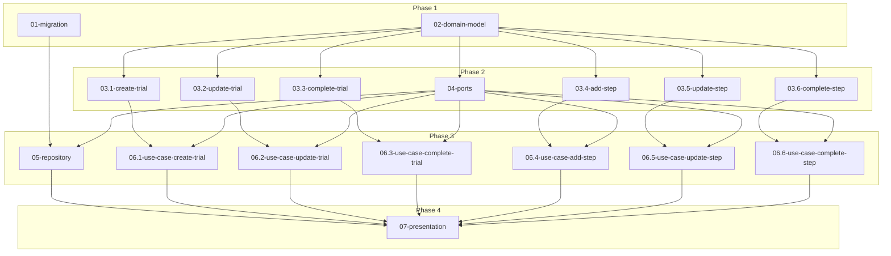

# Feature: Trial モデルと関連アクション

## 概要

Trial モデルと Trial の作成から完了までのアクションを実装する。Trial は Project に紐づく試行記録であり、複数の Step（工程）で構成される。各 Step には任意のパラメーター（材料、温度、時間など）を設定可能。

## 元の要件

> trial モデルと trial モデルの作成 -> 完了までのアクションを定義します
>
> - trial は project と 1:N のリレーションを持つ
> - trial モデルは複数のステップから構成される
>   - 例えばバゲット project の trial であれば捏ね、一次発行、成型、二時発行、焼成などのステップからなる
>   - ステップごとに任意のパラメーター（材料、温度、時間など）を設定可能
>     - 捏ねステップでは粉の量、水の量、水の温度、捏ね時間など
>     - 発酵ステップでは発酵時間、発酵場所、発酵温度など
>     - 成型ステップでは分割重量、成型方法など
>     - 焼成ステップでは焼成温度、焼成時間、焼成方法など
>       - 予熱温度、オーブンに入れてから何分後に温度を何度に設定、など時間変化による設定の変化も記録可能としたい
>   - パラメーターはいくつかの種類を想定
>     - key-value : 材料と分量など、強力粉 : 300g、発酵場所 : 冷蔵庫、発酵温度 : 35C など
>     - 時間 : 発酵時間、焼成時間などの経過時間の記録、焼成開始から何分後といった特定の時間をポイントするものなど
>     - テキスト : 成型方法や焼成方法など、自由記述のもの
>   - 今後の拡張性（加水率の計算など）を考慮して単位を厳密に記録できるようにしたい（'300g' などのテキストとしてではなく、{ amount: 300, unit: g } のような構造で記録するイメージ）
> - trial を aggregate root として、trial step、step と parameter のリレーションを定義する
> - 想定するアクション
>   - trial の作成
>   - step の追加
>   - step の更新
>   - step の完了
>   - trial の完了

---

## 要件分析

### 機能要件

- Trial の CRUD 操作（作成、更新、完了）
- Step の CRUD 操作（追加、更新、完了）
- Parameter の管理（Step に紐づく）
- パラメーターの型: KeyValue、Duration、TimeMarker、Text
- 単位付き値の構造化記録（Quantity、DurationValue）

### 非機能要件

- Trial を aggregate root として設計（Step、Parameter は Trial 経由でアクセス）
- 将来の拡張性を考慮した単位の構造化

---

## 影響範囲

| レイヤー | 影響 | 変更概要 |
|----------|------|----------|
| migration | あり | trials, steps, parameters テーブル作成 |
| domain | あり | Trial, Step, Parameter モデル、6つのアクション |
| ports | あり | TrialRepository トレイト定義 |
| repository | あり | PgTrialRepository 実装 |
| use_case | あり | 6つのユースケース |
| presentation | あり | Trial 関連の GraphQL スキーマ・リゾルバー |

---

## データモデル設計

### Trial

| フィールド | 型 | 説明 |
|------------|-----|------|
| id | TrialId (UUID) | 識別子 |
| project_id | ProjectId (UUID) | 所属プロジェクト |
| name | Option<String> | 任意の名前 |
| memo | Option<String> | 備考・ノート |
| status | TrialStatus | InProgress / Completed |
| created_at | DateTime | 作成日時 |
| updated_at | DateTime | 更新日時 |

### Step

| フィールド | 型 | 説明 |
|------------|-----|------|
| id | StepId (UUID) | 識別子 |
| trial_id | TrialId (UUID) | 所属 Trial |
| name | String | ステップ名（捏ね、発酵など） |
| position | i32 | 順序（0始まり、追加順に自動付与） |
| started_at | Option<DateTime> | 開始日時 |
| completed_at | Option<DateTime> | 完了日時 |
| created_at | DateTime | 作成日時 |
| updated_at | DateTime | 更新日時 |

### Parameter

| フィールド | 型 | 説明 |
|------------|-----|------|
| id | ParameterId (UUID) | 識別子 |
| step_id | StepId (UUID) | 所属 Step |
| content | ParameterContent | パラメーターの内容（enum） |
| created_at | DateTime | 作成日時 |
| updated_at | DateTime | 更新日時 |

### ParameterContent (enum)

```
KeyValue {
  key: String,
  value: ParameterValue,
}

Duration {
  duration: DurationValue,
  note: Option<String>,
}

TimeMarker {
  at: DurationValue,
  note: String,
}

Text {
  value: String,
}
```

### ParameterValue / DurationValue

```
ParameterValue {
  Text(String)
  Quantity { amount: f64, unit: String }
}

DurationValue {
  value: f64,
  unit: String,
}
```

---

## タスク分解

### 分解方針

- migration と domain-model は並列実行可能
- domain-actions はアクションごとに分割し並列実行
- ports / repository は aggregate root 設計のため分割せず
- use-case はアクションごとに分割し並列実行
- presentation は GraphQL スキーマの整合性を保つためまとめる

### タスク一覧

| # | タスク | ディレクトリ | 依存 |
|---|--------|--------------|------|
| 01 | マイグレーション | [01-migration/](./tasks/01-migration/) | - |
| 02 | ドメインモデル | [02-domain-model/](./tasks/02-domain-model/) | - |
| 03.1 | create_trial アクション | [03.1-domain-action-create-trial/](./tasks/03.1-domain-action-create-trial/) | 02 |
| 03.2 | update_trial アクション | [03.2-domain-action-update-trial/](./tasks/03.2-domain-action-update-trial/) | 02 |
| 03.3 | complete_trial アクション | [03.3-domain-action-complete-trial/](./tasks/03.3-domain-action-complete-trial/) | 02 |
| 03.4 | add_step アクション | [03.4-domain-action-add-step/](./tasks/03.4-domain-action-add-step/) | 02 |
| 03.5 | update_step アクション | [03.5-domain-action-update-step/](./tasks/03.5-domain-action-update-step/) | 02 |
| 03.6 | complete_step アクション | [03.6-domain-action-complete-step/](./tasks/03.6-domain-action-complete-step/) | 02 |
| 04 | TrialRepository トレイト | [04-ports/](./tasks/04-ports/) | 02 |
| 05 | PgTrialRepository 実装 | [05-repository/](./tasks/05-repository/) | 01, 04 |
| 06.1 | create_trial ユースケース | [06.1-use-case-create-trial/](./tasks/06.1-use-case-create-trial/) | 03.1, 04 |
| 06.2 | update_trial ユースケース | [06.2-use-case-update-trial/](./tasks/06.2-use-case-update-trial/) | 03.2, 04 |
| 06.3 | complete_trial ユースケース | [06.3-use-case-complete-trial/](./tasks/06.3-use-case-complete-trial/) | 03.3, 04 |
| 06.4 | add_step ユースケース | [06.4-use-case-add-step/](./tasks/06.4-use-case-add-step/) | 03.4, 04 |
| 06.5 | update_step ユースケース | [06.5-use-case-update-step/](./tasks/06.5-use-case-update-step/) | 03.5, 04 |
| 06.6 | complete_step ユースケース | [06.6-use-case-complete-step/](./tasks/06.6-use-case-complete-step/) | 03.6, 04 |
| 07 | GraphQL 実装 | [07-presentation/](./tasks/07-presentation/) | 05, 06.1〜06.6 |

### 実装順序



---

## 前提条件

- Project モデルが既に存在すること
- ProjectRepository が実装済みであること

## オープンクエスチョン

なし
