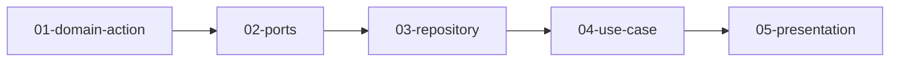

# Feature: create-project

## 概要
プロジェクト新規作成のための GraphQL mutation を追加する。

## 元の要件
> backend に projects の新規作成 mutation の追加をしたいです

---

## 要件分析

### 機能要件
- GraphQL mutation `createProject` を追加する
- 入力として `name`（プロジェクト名）を受け取る
- 新規プロジェクトを作成し、作成されたプロジェクトを返す
- プロジェクト名が空の場合はエラーを返す
- プロジェクト名が重複している場合はエラーを返す（既存の UNIQUE 制約を活用）

### 非機能要件
- なし

---

## 影響範囲

| レイヤー | 影響 | 変更概要 |
|----------|------|----------|
| domain   | あり | `create_project` アクションの追加 |
| ports    | あり | `ProjectRepository` に `save()`, `exists_by_name()` メソッド追加 |
| use_case | あり | `create_project` ユースケースの追加 |
| repository | あり | `save()`, `exists_by_name()` の SQL 実装 |
| presentation | あり | `CreateProjectInput`, `ProjectMutation` の追加 |
| migration | なし | 既存テーブル構造で対応可能 |

---

## タスク分解

### 分解方針
アーキテクチャの依存方向に沿って、内側のレイヤーから外側へ順に実装する。各タスクは独立した単位でテスト可能であることを重視。

### タスク一覧

| # | タスク | ディレクトリ | 依存 |
|---|--------|--------------|------|
| 01 | Domain アクション実装 | [01-domain-action/](./tasks/01-domain-action/) | - |
| 02 | Ports トレイト拡張 | [02-ports/](./tasks/02-ports/) | 01 |
| 03 | Repository 実装 | [03-repository/](./tasks/03-repository/) | 02 |
| 04 | UseCase 実装 | [04-use-case/](./tasks/04-use-case/) | 03 |
| 05 | Presentation 実装 | [05-presentation/](./tasks/05-presentation/) | 04 |

### 実装順序

---

## 前提条件
- `projects` テーブルが存在すること（`name` に UNIQUE 制約あり）
- 既存の `Project` モデル、`ProjectRepository` トレイト、`PgProjectRepository` 実装が存在すること

## オープンクエスチョン

なし
