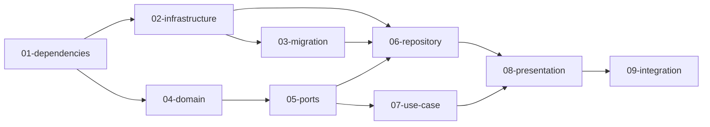

# Feature: get-minimum-project

## 概要
最低限の Project（ID、名前のみ）の取得クエリーを公開する。プロジェクトの最初の機能実装。

## 元の要件
> これはこのプロジェクトの最初の開発です（現在は最低限の疎通確認コードのみ）
> まず初めに最低限の Project（ID、名前のみ）の取得クエリーを公開したいです
> 登録の機能がありませんが最初は手動で DB を操作してサンプルデータを投入する想定です

---

## 要件分析

### 機能要件
- 全プロジェクトの一覧を取得するGraphQLクエリー (`projects`)
- 単一プロジェクトをIDで取得するGraphQLクエリー (`project(id: ID!)`)
- 返却するフィールドは最小限: `id`, `name`

### 非機能要件
- 現時点では認証・認可は不要（後続開発で追加の可能性もある）
- サンプルデータは手動でDBに投入する想定

---

## 影響範囲

| レイヤー | 影響 | 変更概要 |
|----------|------|----------|
| domain   | あり | Project モデルの新規作成（最小限のフィールド: ID, name） |
| ports    | あり | ProjectRepository トレイトの新規作成（find_by_id, find_all） |
| use_case | あり | get_project, list_projects ユースケースの新規作成 |
| repository | あり | PgProjectRepository の実装（PostgreSQL） |
| presentation | あり | GraphQL スキーマ・リゾルバーの実装 |
| infrastructure | あり | データベース接続プールの実装 |
| migration | あり | projects テーブルの作成 |

---

## タスク分解

### 分解方針
プロジェクトの初期実装のため、各レイヤーを順に構築する必要がある。依存関係に従い、内側のレイヤー（domain）から外側のレイヤー（presentation）へ向かって実装する。

ただし、infrastructure（DB接続）と migration（テーブル作成）は他のレイヤーに先行して準備が必要なため、最初に実施する。

### タスク一覧

| # | タスク | ディレクトリ | 依存 |
|---|--------|--------------|------|
| 01 | Cargo.toml 依存クレート追加 | [01-dependencies/](./tasks/01-dependencies/) | - |
| 02 | Infrastructure層（DB接続プール） | [02-infrastructure/](./tasks/02-infrastructure/) | 01 |
| 03 | DBマイグレーション（projects テーブル） | [03-migration/](./tasks/03-migration/) | 02 |
| 04 | Domain層（Project モデル） | [04-domain/](./tasks/04-domain/) | 01 |
| 05 | Ports層（ProjectRepository トレイト） | [05-ports/](./tasks/05-ports/) | 04 |
| 06 | Repository層（PostgreSQL実装） | [06-repository/](./tasks/06-repository/) | 02, 03, 05 |
| 07 | UseCase層（get_project, list_projects） | [07-use-case/](./tasks/07-use-case/) | 05 |
| 08 | Presentation層（GraphQL スキーマ・リゾルバー） | [08-presentation/](./tasks/08-presentation/) | 06, 07 |
| 09 | main.rs の統合・Axum ルーティング | [09-integration/](./tasks/09-integration/) | 08 |

### 実装順序

---

## 前提条件
- PostgreSQL がローカルまたは Docker で起動可能であること
- compose.yaml で PostgreSQL が定義されていること（要確認）

## オープンクエスチョン

なし
