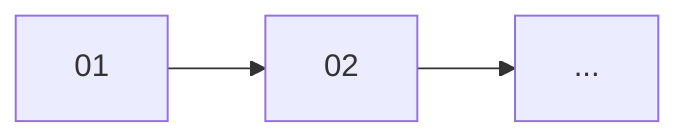

# 設計コマンド

**ユーザーの要件:** $ARGUMENTS

---

## このコマンドの目的

ユーザーの機能要件を分析し、各レイヤーで必要な変更を設計仕様として出力する。
実装は行わず、設計のみを行う。

---

## 出力ファイル構成

```
.agents/features/{yyyymmdd}-{feature_name}/
├── spec.md                        # 要件分析 + タスク分解
└── tasks/
    ├── 01-{task-name}/
    │   ├── spec.md                # タスク仕様
    │   └── ...                    # (任意) 補足資料
    ├── 02-{task-name}/
    │   └── spec.md
    └── ...
```

---

## 事前準備

以下のドキュメントを参照して、プロジェクトの設計思想とレイヤー構成を理解すること:

1. **AGENTS.md** - プロジェクト概要とアーキテクチャ
2. **各レイヤーのコーディングルール** - `.claude/rules/` 配下

---

## Phase 1: 要件分析

### 1.1 要件の整理

ユーザーの要件を以下の観点で整理する:

- **機能要件**: 何ができるようになるか
- **非機能要件**: パフォーマンス、セキュリティ等（該当する場合）

### 1.2 影響範囲の特定

各レイヤーへの影響を判断する:

| レイヤー | 確認ポイント |
|----------|--------------|
| domain | 新規モデル or 既存モデル変更 or 新規アクションが必要か |
| ports | 新規リポジトリメソッドが必要か |
| use_case | 新規ユースケースが必要か |
| repository | DB操作の実装が必要か |
| presentation | GraphQL スキーマ/リゾルバーの変更が必要か |
| migration | テーブル追加/変更が必要か |

---

## Phase 2: オープンクエスチョンの解決

要件に不明点がある場合は、**実装前に解決する**。

### 対話で解決すべき問題

- 仕様の曖昧さ（例: 上限値、許可される操作）
- 複数の実装方針がある場合の選択
- 既存機能との整合性

### 先送り可能な問題

実装を進めないと判断が難しい問題は、ユーザーと合意の上で先送りできる。
その場合、spec.md のオープンクエスチョンに記録する。

**質問例:**
```
以下について確認させてください:

1. {具体的な質問}
2. {具体的な質問}

また、以下は実装を進めながら判断する方針でよいでしょうか:
- {先送り候補の問題}
```

---

## Phase 3: タスク分解

### 分解の判断基準

**分けるケース:**
- レイヤーをまたぐ大きな変更 → レイヤー別に分割
- 複数エンティティに影響 → エンティティ別に分割
- migration が必要 → 独立タスクに

**分けないケース:**
- 1-2ファイルの小規模な修正 → 1タスクにまとめる
- 分けると依存が複雑になる場合 → まとめる

### タスクの命名規則

`{nn}-{layer or entity}-{action}`

例:
- `01-domain-model` - モデル定義
- `02-domain-action` - アクション実装
- `03-ports` - リポジトリトレイト
- `04-use-case` - ユースケース
- `05-repository` - リポジトリ実装
- `06-presentation` - GraphQL
- `07-migration` - DBマイグレーション

---

## Phase 4: ファイル出力

### feature ディレクトリの命名

`{yyyymmdd}-{feature_name}` の形式で命名する:
- 日付部分: 設計実行日（例: `20260109`）
- feature_name: スネークケースで要件を端的に表す

例:
- `20260109-add_trial_photo`
- `20260109-update_project_status`
- `20260109-bulk_delete_trials`

---

## 出力フォーマット

### spec.md（Feature レベル）

```markdown
# Feature: {feature_name}

## 概要
{1-2行の要約}

## 元の要件
> {ユーザー入力の原文}

---

## 要件分析

### 機能要件
- {要件1}
- {要件2}

### 非機能要件（該当する場合）
- {要件}

---

## 影響範囲

| レイヤー | 影響 | 変更概要 |
|----------|------|----------|
| domain   | あり / なし | {概要} |
| ports    | あり / なし | {概要} |
| use_case | あり / なし | {概要} |
| repository | あり / なし | {概要} |
| presentation | あり / なし | {概要} |
| migration | あり / なし | {概要} |

---

## タスク分解

### 分解方針
{なぜこの粒度で分けたかの説明}

### タスク一覧

| # | タスク | ディレクトリ | 依存 |
|---|--------|--------------|------|
| 01 | {タスク名} | [01-{name}/](./tasks/01-{name}/) | - |
| 02 | {タスク名} | [02-{name}/](./tasks/02-{name}/) | 01 |

### 実装順序


---

## 前提条件
- {既存機能への依存}

## オープンクエスチョン

なし

{または先送りした問題がある場合}
以下は実装を進めながら判断する:
- [ ] {問題の内容}（合意日: YYYY-MM-DD）
```

### spec.md（Task レベル）

```markdown
# Task: {タスク名}

> Feature: [{feature_name}](../../spec.md)
> 依存: {依存タスク or なし}

## 目的
{このタスクで達成すること - 日本語で明確に}

---

## 変更対象

| ファイル | 操作 | 概要 |
|----------|------|------|
| `src/domain/models/xxx.rs` | 新規 / 修正 | {概要} |

---

## 設計詳細

### {セクション名}

{日本語での説明を主とする。コードは必要最小限に。}

- {何をするか}
- {どのような構造にするか}
- {注意点}

```rust
// 必要最小限のコード例（省略可）
```

---

## テストケース

{テストの配置場所とテストケース一覧を記載する}

### テストファイル

- **ユニットテスト**: `src/{layer}/{module}.rs` 内の `#[cfg(test)] mod tests`
- **統合テスト（GraphQL）**: `tests/graphql/{entity}/{operation}.rs`

### 正常系

| テスト名 | 内容 |
|----------|------|
| `test_xxx` | {テスト内容} |

### 異常系

| テスト名 | 内容 |
|----------|------|
| `test_xxx_returns_error_when_yyy` | {テスト内容} |

---

## 補足資料（該当する場合）

| ファイル | 内容 |
|----------|------|
| [xxx.sql](./xxx.sql) | {説明} |

---

## 完了条件

- [ ] {具体的な完了条件}
- [ ] 上記テストケースがすべて実装されている
- [ ] テストが通る
```

### テストの配置ルール

| レイヤー | テスト配置 | 備考 |
|----------|-----------|------|
| domain | `src/domain/actions/{entity}/{action}.rs` 内 | `#[cfg(test)] mod tests` |
| ports | なし | トレイト定義のみのためテスト不要 |
| use_case | `src/use_case/{entity}/{use_case}.rs` 内 | `MockUnitOfWork` 使用 |
| repository | `src/repository/{entity}_repo.rs` 内 | `#[sqlx::test]` 使用 |
| presentation | `tests/graphql/{entity}/{operation}.rs` | 統合テスト |

### GraphQL 統合テストのポイント

- **GET 系（Query）**: `execute_graphql` を使用し、完全な JSON で検証
- **POST 系（Mutation）**: `execute_graphql_with_errors` を使用し、エラーレスポンスも検証可能に
- **テストヘルパー**: `tests/graphql/schema.rs` に共通ヘルパーを定義

---

## 注意事項

- **実装は行わない**: このコマンドは設計のみ
- **日本語での説明を優先**: コードは「何をすべきか」を補足する程度に留める
- **オープンクエスチョンは解決してから進む**: 先送りする場合は合意を得て記録する
- **スキルドキュメントを参照**: 各レイヤーのルールに従った設計を行う
