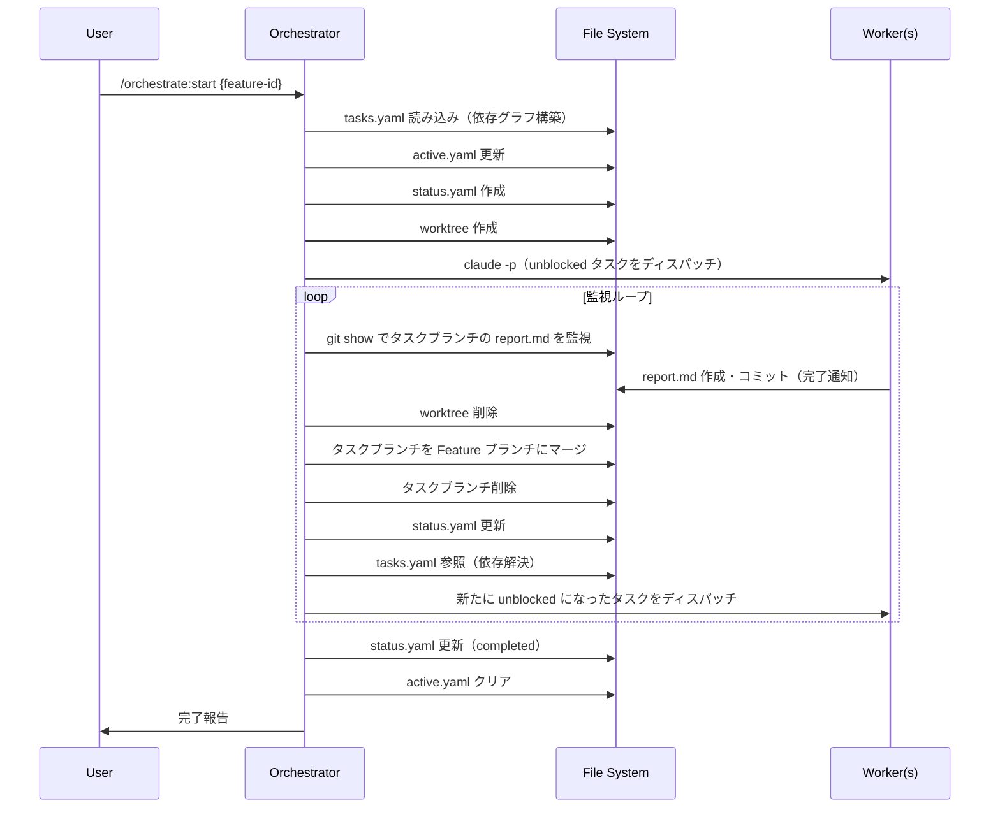
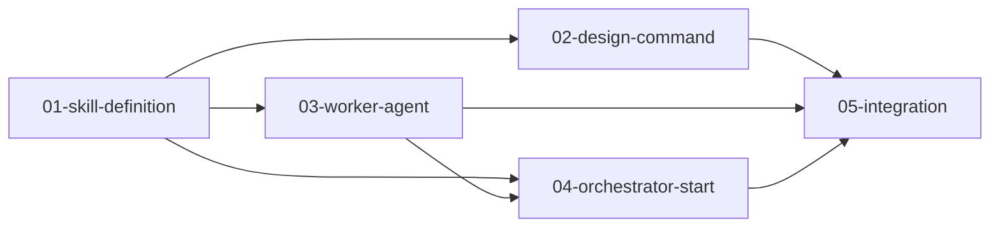

# ワークフロー詳細

並列オーケストレーション機構のワークフローを図示。

---

## 全体フロー



---

## フェーズ別詳細

### Phase 1: 設計（/orchestrate:design）

```
[ユーザー入力: 要件]
         ↓
  [要件分析]
         ↓
  [タスク分解]
         ↓
  [依存関係特定]
         ↓
  [Feature ブランチ作成]
    git checkout -b feature/{feature-id}
         ↓
  [ファイル出力]
         ↓
┌─────────────────────────────────────┐
│ .agents/features/{feature-id}/      │
│ ├── spec.md                         │
│ ├── tasks.yaml                      │
│ └── tasks/                          │
│     ├── 01-xxx/spec.md              │
│     ├── 02-xxx/spec.md              │
│     └── ...                         │
└─────────────────────────────────────┘
```

---

### Phase 2: 初期化（/orchestrate:start）

```
[tasks.yaml 読み込み]
         ↓
[依存グラフ構築]
         ↓
[Feature ブランチ確認]
  現在のブランチが feature/{feature-id} ?
    Yes → そのまま継続
    No  → git checkout -b feature/{feature-id}
         ↓
[active.yaml 更新]
         ↓
[status.yaml 作成]
  status: in_progress
  pending_tasks: [全タスク]
```

---

### Phase 3: ディスパッチ

```
[依存解消タスク抽出]
  dependencies が空、または
  全て completed_tasks に含まれる
         ↓
[start-worker.sh でワーカー起動]
  worktree 作成 + claude -p を一括実行
  PID を返却
      ↓
[status.yaml 更新]
  active_tasks に追加（PID 記録）
  pending_tasks から削除
```

---

### Phase 4: 監視ループ

```
[wait-for-completion.sh を run_in_background で起動]
  - active.yaml / status.yaml から監視対象を自動取得
  - ポーリング間隔: 30秒→45秒→...→最大300秒
      ↓
スクリプト exit（完了 or クラッシュ検知）
  CRASHED:{task_id} → エラー処理
  COMPLETED:{task_id} ↓
[マージ（オーケストレーターがエージェンティックに実行）]
  git merge task/{id}_{task-id}
  コンフリクト時は内容を判断して解決
      ↓
[complete-task.sh 実行（クリーンアップ）]
  worktree 削除 → ブランチ削除 → status.yaml 更新
      ↓
[依存解消チェック]
      ↓
新たに unblocked なタスク?
  Yes → ディスパッチ
  No  ↓
全タスク完了?
  No  → wait-for-completion.sh を再起動 → ループ先頭へ
  Yes → 完了処理へ
```

---

### Phase 5: 完了処理

```
[全タスク完了を確認]
         ↓
[status.yaml 更新]
   status: completed
         ↓
[active.yaml クリア]
   active_feature: null
         ↓
[完了レポート出力]
   次のステップを案内
```

---

## 依存解決の例

### タスク構成

```
tasks:
  - id: 01-skill-definition
    dependencies: []

  - id: 02-design-command
    dependencies: [01-skill-definition]

  - id: 03-worker-agent
    dependencies: [01-skill-definition]

  - id: 04-orchestrator-start
    dependencies: [01-skill-definition, 03-worker-agent]

  - id: 05-integration
    dependencies: [02-design-command, 03-worker-agent, 04-orchestrator-start]
```

### 実行順序（並列考慮）

```
時刻 T0: 01-skill-definition 開始
         ↓
時刻 T1: 01 完了
         02-design-command 開始（並列）
         03-worker-agent 開始（並列）
         ↓
時刻 T2: 02 完了, 03 完了
         04-orchestrator-start 開始
         ↓
時刻 T3: 04 完了
         05-integration 開始
         ↓
時刻 T4: 07 完了
         全タスク完了
```

### 依存グラフ


