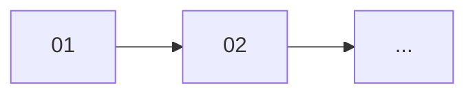

# Feature: {feature_name}

## 概要

{1-2行の要約}

## 元の要件

> {ユーザー入力の原文}

---

## 要件分析

### 機能要件

- {要件1}
- {要件2}

### 非機能要件（該当する場合）

- {要件}

---

## 影響範囲

| レイヤー | 影響 | 変更概要 |
|----------|------|----------|
| domain   | あり / なし | {概要} |
| ports    | あり / なし | {概要} |
| use_case | あり / なし | {概要} |
| repository | あり / なし | {概要} |
| presentation | あり / なし | {概要} |
| migration | あり / なし | {概要} |

---

## タスク分解

### 分解方針

{なぜこの粒度で分けたかの説明}

### タスク一覧

| # | タスク | ディレクトリ | 依存 |
|---|--------|--------------|------|
| 01 | {タスク名} | [01-{name}/](./tasks/01-{name}/) | - |
| 02 | {タスク名} | [02-{name}/](./tasks/02-{name}/) | 01 |

### 実装順序

---

## 前提条件

- {既存機能への依存}

## オープンクエスチョン

なし

<!-- 先送りした問題がある場合は以下の形式で記載 -->
<!--
以下は実装を進めながら判断する:
- [ ] {問題の内容}（合意日: YYYY-MM-DD）
-->
