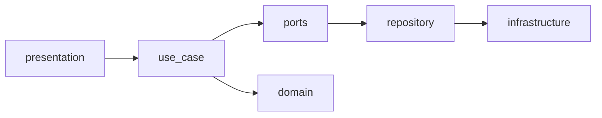
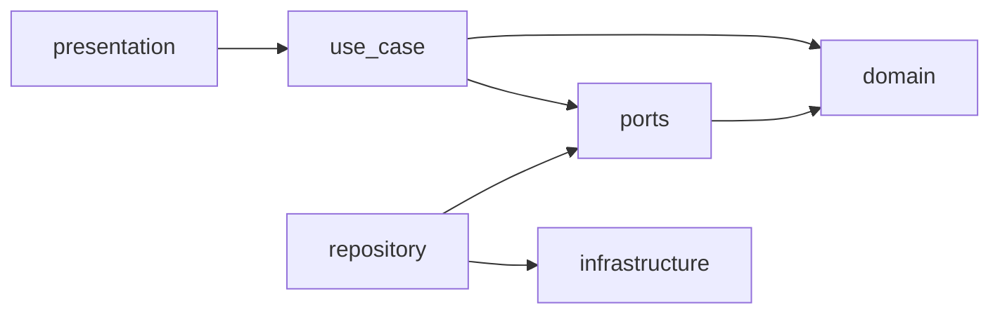

# AGENTS.md
## プロジェクト概要と設計思想

### 1. プロジェクト概要：bake-loose (ベイク・ルース)

このプロジェクトはパン・ピザといった複雑な調理において技術習得のための試行錯誤の履歴を構造的に記録・分析するためのパーソナルラボノートです
材料の配分・温度・発酵時間など様々な要素が影響するため完成された単一のレシピではなくプロセスの記録が重要となる

#### アプリケーションの目的
- 料理のPDCAサイクルを回し個人の技術レベルを科学的に向上させるためのツール
- クックパッドなどの結果共有ではなくプロセス管理と内省に特化する

#### 主要機能
- 試行(Trial)の記録
  - 特定の料理(Project)に対し複数の試行(Trial)を記録
- パラメーター管理
  - 加水率・捏ね時間・発酵温度など不定形な数値を構造化して記録
- フィードバック
  - Trialごとのフィードバックを記録
  - フィードバックはTrialに対して複数記録できる
    - 複数人からの評価を記録
    - 時間経過による味の変化を記録

#### UI/UX
- モバイルファースト(PWA)
  - 調理中のストレスを最小限にするためのシンプルな入力体験を実現

---

### 2. リポジトリの構成と技術スタック

このリポジトリはバックエンドとフロントエンドのコードを格納し技術キャッチアップと堅牢性を重視したモダンなスタックを採用する

#### バックエンド
- Rust (Axum)
  - メモリ安全性と高性能の学習
  - 型安全なWeb API構築経験

#### プロトコル
- GraphQL (Async-GraphQL)
  - 階層的データ構造(Project → Trial → Feedback)の効率的な取得
  - モダンAPI設計スキル習得

#### データベース
- PostgreSQL
  - 堅牢なデータ永続化
  - 不定形な調理パラメーターを格納するためのJSONB型を積極的に活用

#### フロントエンド
- Vite + React / TypeScript
  - 高速な開発体験とシンプルな構成
  - React Router によるクライアントサイドルーティング
  - Apollo Client または urql による GraphQL 連携
  - モバイルPWAによるネイティブ体験の実現 (Workbox)
- UI/UX
  - Tailwind CSS / shadcn/ui
  - 迅速なUI構築とモダンなデザインキャッチアップ

---

### 3. アプリケーションの設計思想とアーキテクチャ

#### 中心から外へ: ドメインファーストな開発アプローチ

このプロジェクトではドメインモデルとそのアクション(振る舞い)を最重要なリソースと定義し、それを中心に据えて外側の層を実装する開発手法を採用する

開発の流れ:
1. ドメインモデルの状態とアクションを定義(純粋なビジネスロジック)
2. ドメイン層が永続化や外部システムの存在を知らない形で設計
3. ユースケース層でアクションを組み合わせた業務フローを実装
4. プレゼンテーション層・インフラ層といった外側のレイヤーを後から実装

この順序により以下を実現する:
- ビジネスロジックがドメイン層に凝集される
- 永続化の詳細(PostgreSQL, JSONB等)はインフラ層の関心事として分離
- データベースやフレームワークの変更がドメインコードに影響しない

参考: [永続化を切り離したドメインモデリング](https://zenn.dev/jtechjapan_pub/articles/fc9878ec69b6a1)

#### A. ドメイン層: モデルとアクション

まず永続化を考えずにビジネスの状態と振る舞いを定義する

- モデル(状態)
  - Project
    - 調理テーマの情報(名前・説明・目標など)
    - 関連するTrialのIDリスト
  - Trial
    - 試行回の情報(実施日・パラメーター・結果など)
    - 関連するFeedbackのIDリスト
  - Feedback
    - 評価の情報(評価者・評価日時・コメント・スコアなど)

- アクション(振る舞い)
  - Project
    - create_project: 新しいプロジェクトを作成
    - update_project: プロジェクト情報を更新
    - archive_project: プロジェクトをアーカイブ
  - Trial
    - record_trial: 新しい試行を記録
    - update_trial_parameters: パラメーターを更新
    - delete_trial: 試行を削除
  - Feedback
    - add_feedback: フィードバックを追加
    - update_feedback: フィードバックを更新
    - delete_feedback: フィードバックを削除

これらのアクションは純粋な関数として実装しバリデーションやビジネスルールのチェックを行う

#### B. ユースケース層: アクションのオーケストレーション

ドメインアクションを組み合わせて業務フローを実現する層

- 役割
  - ドメインアクションを呼び出す
  - アクションの結果に応じた制御フロー
  - リポジトリ(インフラ層)を呼び出してデータを永続化
  - トランザクション境界の管理

- 実装例
  - CreateProjectUseCase
    - Project::create_projectアクションを呼び出す
    - バリデーション成功ならProjectRepositoryで永続化
    - 失敗なら適切なエラーを返す
  - RecordTrialUseCase
    - Trial::record_trialアクションを呼び出す
    - 成功ならTrialRepositoryで永続化しProjectに紐づける
    - 必要に応じて他の集約への影響を処理

#### C. 各層の責務

| 層 | ディレクトリ | 責務 |
|----|-------------|------|
| **presentation** | `src/presentation/` | GraphQLリゾルバー。ユースケースを呼び出す薄い層 |
| **use_case** | `src/use_case/` | ビジネスフローのオーケストレーション |
| **ports** | `src/ports/` | リポジトリのトレイト定義（境界の抽象化） |
| **repository** | `src/repository/` | portsの実装。DBスキーマ・SQL・変換ロジック |
| **infrastructure** | `src/infrastructure/` | DB接続など純粋な技術機能 |
| **domain** | `src/domain/` | モデルとアクション（純粋なビジネスロジック） |

#### D. バックエンドディレクトリ構成

```
backend/src/
├── main.rs
├── lib.rs
│
├── domain/
│   ├── models/
│   │   ├── project.rs
│   │   └── ...
│   └── actions/
│       └── ...
│
├── use_case/
│   ├── project/
│   │   ├── create_project.rs
│   │   └── ...
│   └── ...
│
├── ports/
│   ├── project_repository.rs
│   └── ...
│
├── repository/
│   ├── project_repo.rs
│   └── ...
│
├── infrastructure/
│   └── database.rs
│
└── presentation/
    └── graphql/
        ├── schema.rs
        └── ...
```

#### E. 呼び出しの流れ（実行時）



#### F. 依存の方向（コンパイル時）



**ポイント:**
- `domain` は何にも依存しない（最内側）
- `ports` はトレイト定義、`repository` がその実装
- `use_case` は `ports` 経由で永続化（具体実装を知らない）

#### G. データフローの例

ユーザーが新しい試行を記録する場合の流れ:
1. フロントエンド(React SPA)がGraphQL mutationを送信
2. GraphQLリゾルバーがRecordTrialUseCaseを呼び出す
3. ユースケースがTrial::record_trialアクションを実行
4. バリデーション成功後TrialRepositoryで永続化
5. 結果をGraphQL経由でフロントエンドに返す

この多層構造によりドメインロジックを中心に据えつつ各層の責務を明確に分離したアプリケーションを構築する
