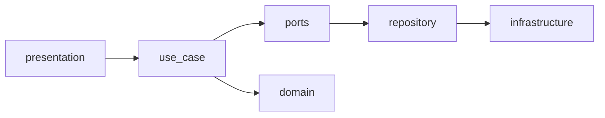
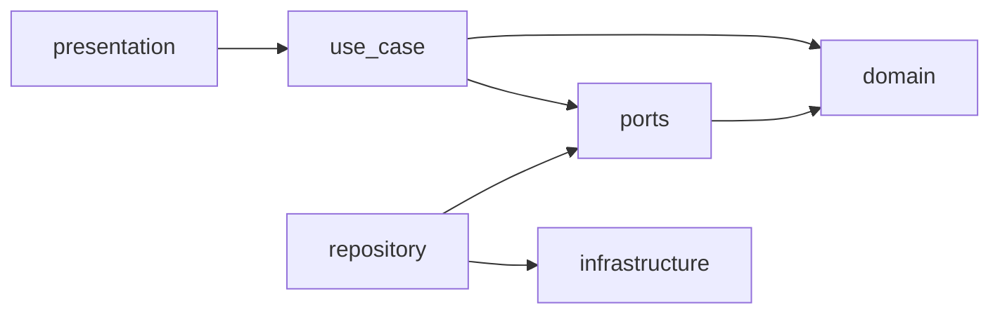

# bake-loose

パン・ピザ作りの試行錯誤を記録・分析するパーソナルラボノート

## システム概要

bake-loose は、パン・ピザといった複雑な調理における技術習得のための試行錯誤の履歴を構造的に記録・分析するアプリケーションです。

### 目的

- 料理の PDCA サイクルを回し、個人の技術レベルを科学的に向上させる
- クックパッドなどの結果共有ではなく、プロセス管理と内省に特化

### 主要機能

| 機能 | 説明 |
|------|------|
| **Project** | 調理テーマ（例: カンパーニュ、ナポリピッツァ）を管理 |
| **Trial** | 各プロジェクトに対する試行を記録（加水率、発酵温度、捏ね時間など） |
| **Feedback** | 試行ごとの評価を記録（複数人・時間経過による変化も対応） |

### 技術スタック

| レイヤー | 技術 |
|---------|------|
| Frontend | Vite + React / TypeScript |
| Backend | Rust (Axum) + GraphQL (Async-GraphQL) |
| Database | PostgreSQL |
| Infrastructure | Docker Compose |

## 環境構築手順

### 前提条件

- Docker Desktop がインストールされていること
- Docker Compose が利用可能であること

### 起動手順

```bash
# リポジトリをクローン
git clone <repository-url>
cd bake-loose

# コンテナをビルド・起動
docker compose up --build
```

### サービス一覧

| サービス | URL | 説明 |
|---------|-----|------|
| Frontend | http://localhost:3000 | React SPA |
| Backend | http://localhost:8080 | Axum API サーバー |
| Database | localhost:5432 | PostgreSQL |

### 環境変数

| 変数名 | サービス | デフォルト値 | 説明 |
|--------|---------|-------------|------|
| `POSTGRES_USER` | db | bakeloose | DB ユーザー名 |
| `POSTGRES_PASSWORD` | db | bakeloose | DB パスワード |
| `POSTGRES_DB` | db | bakeloose | DB 名 |
| `DATABASE_URL` | backend | postgres://bakeloose:bakeloose@db:5432/bakeloose | 接続文字列 |
| `RUST_LOG` | backend | debug | ログレベル |
| `VITE_API_URL` | frontend | http://localhost:8080 | Backend API URL |

## 開発方法

### ディレクトリ構成

```
bake-loose/
├── compose.yaml
├── backend/
│   ├── Dockerfile
│   ├── Cargo.toml
│   └── src/
│       ├── main.rs
│       ├── lib.rs
│       ├── domain/           # モデル・アクション（純粋）
│       ├── use_case/         # ビジネスフロー
│       ├── ports/            # リポジトリトレイト
│       ├── repository/       # ports実装（SQL・スキーマ）
│       ├── infrastructure/   # DB接続
│       └── presentation/     # GraphQL
└── frontend/
    ├── Dockerfile
    ├── package.json
    └── src/
        └── ...
```

### 開発サーバーの起動

```bash
docker compose up
```

- **Backend**: `cargo-watch` によるホットリロード（ソース変更時に自動再コンパイル）
- **Frontend**: Vite HMR によるホットリロード

### コンテナへのアクセス

```bash
# Backend コンテナに入る
docker compose exec backend bash

# Frontend コンテナに入る
docker compose exec frontend sh

# PostgreSQL に接続
docker compose exec db psql -U bakeloose -d bakeloose
```

### ログの確認

```bash
# 全サービスのログ
docker compose logs -f

# 特定サービスのログ
docker compose logs -f backend
docker compose logs -f frontend
```

### コンテナの停止・削除

```bash
# 停止（コンテナを保持、再開が速い）
docker compose stop

# 再開
docker compose start

# 停止してコンテナを削除（クリーンアップ）
docker compose down

# ボリュームも含めて削除（DB データもリセット）
docker compose down -v
```

### Backend 開発

Backend は Rust + Axum で構築されています。

```bash
# コンテナ内でビルド確認
docker compose exec backend cargo build

# テスト実行
docker compose exec backend cargo test

# フォーマット
docker compose exec backend cargo fmt

# Lint
docker compose exec backend cargo clippy
```

### Frontend 開発

Frontend は Vite + React + TypeScript で構築されています。

```bash
# コンテナ内で依存関係追加
docker compose exec frontend pnpm add <package>

# 型チェック
docker compose exec frontend pnpm tsc --noEmit

# Lint
docker compose exec frontend pnpm lint
```

## アーキテクチャ

ドメインモデルを中心に据え、外側のレイヤーに依存しない設計を採用。

### レイヤー構成

| 層 | 責務 |
|----|------|
| **presentation** | GraphQLリゾルバー |
| **use_case** | ビジネスフローのオーケストレーション |
| **ports** | リポジトリトレイト（境界の抽象化） |
| **repository** | portsの実装（SQL・スキーマ） |
| **infrastructure** | DB接続など純粋な技術機能 |
| **domain** | モデルとアクション（純粋なビジネスロジック） |

### 呼び出しの流れ（実行時）



### 依存の方向（コンパイル時）



詳細は [AGENTS.md](./AGENTS.md) を参照。
